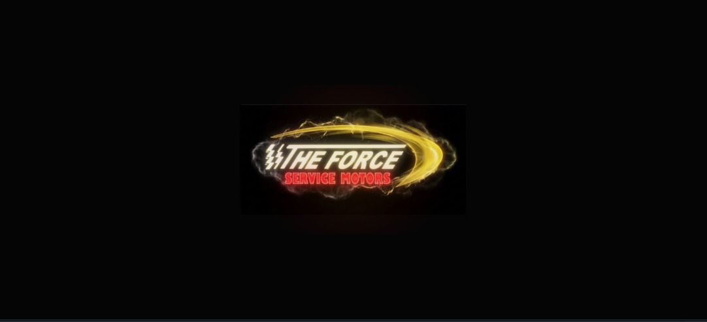
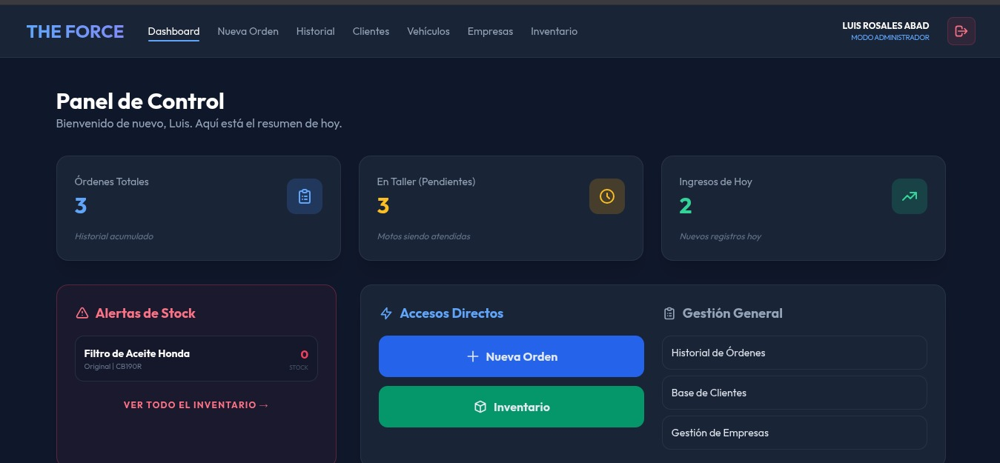
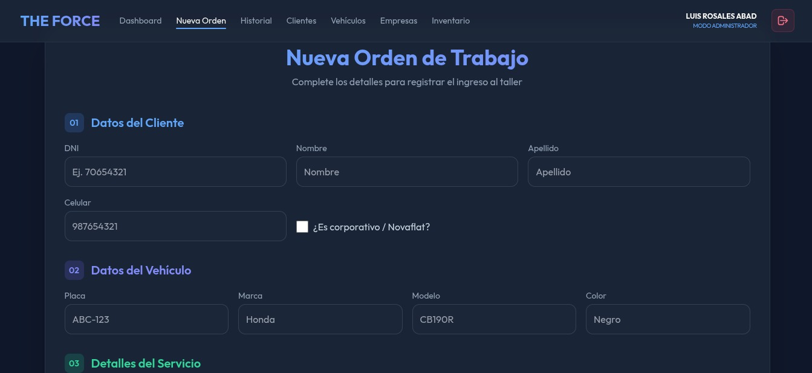
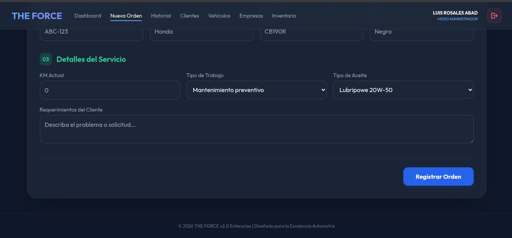
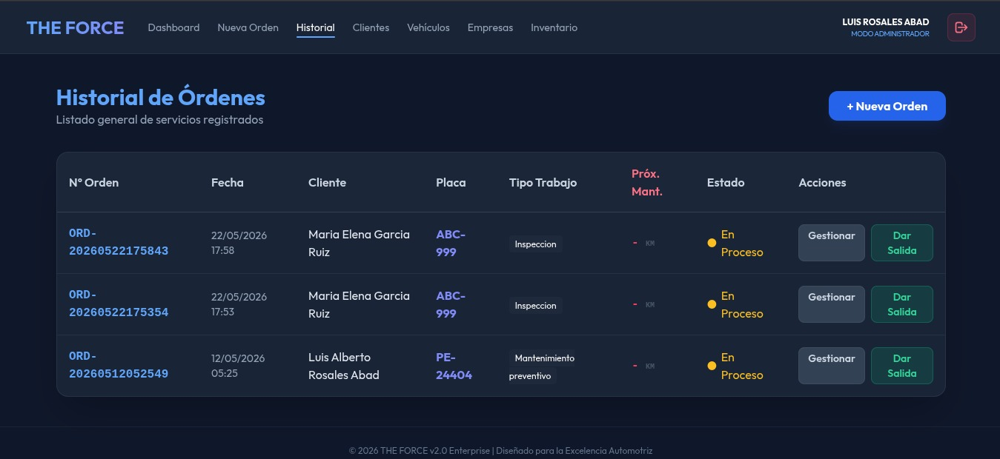
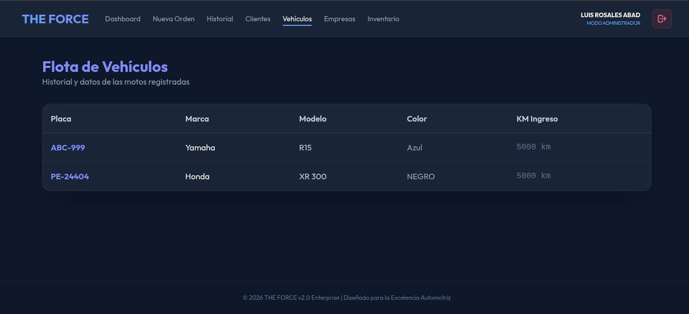
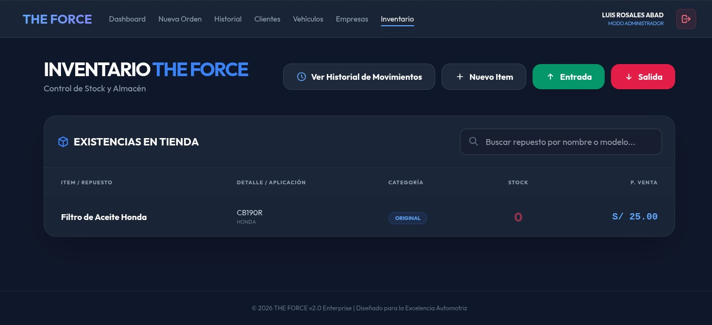

# ⚡ The Force System v2.0

> **Documentación Ejecutiva y Análisis Técnico Estructural**  
> Sistema de gestión optimizado para talleres de motocicletas, desarrollado bajo un entorno local enfocado en la persistencia de datos, control de inventarios y flujos de trabajo asíncronos.

---

## 🛠️ Tecnologías Utilizadas

    Python & FastAPI
    Uvicorn Server
    HTML5 Semántico
    CSS3 Variables
    JavaScript Async

---

## 📊 Módulos del Sistema y Evidencias Técnicas

<!-- CUADRO 1 -->

    <h3 style="color: #ffffff; margin-top: 0;">1. Pantalla de Carga Animada (Splash Screen)</h3>
    
Muestra el logo de The Force centrado, iluminando la interfaz oscura antes de dar acceso al sistema.

    
    

        <h4 style="color: #58a6ff; margin: 0 0 8px 0; font-size: 14px; text-transform: uppercase;">Análisis Técnico:</h4>
        <ul style="margin: 0; padding-left: 20px; color: #c9d1d9;">
            <li>Bloquea la pantalla completa mediante capas superpuestas (<code>#050505</code>).</li>
            <li>Aplica transformaciones sutiles de escala (<code>transform: scale()</code>) en sincronía con gradientes radiales interactivos.</li>
            <li>Flujo controlado con un retardador JavaScript asíncrono de 2.5 segundos para evitar redirecciones cíclicas.</li>
        </ul>
    

<!-- CUADRO 2 -->

    <h3 style="color: #ffffff; margin-top: 0;">2. Panel de Control e Indicadores Centrales (Dashboard)</h3>
    
Interfaz principal de administración que centraliza el estado del taller en tiempo real.

    
    

        <h4 style="color: #f2cc60; margin: 0 0 8px 0; font-size: 14px; text-transform: uppercase;">Análisis Técnico:</h4>
        <ul style="margin: 0; padding-left: 20px; color: #c9d1d9;">
            <li>Valida y muestra en la barra superior el usuario autenticado con privilegios de superusuario (Luis Rosales Abad).</li>
            <li>Renderiza de forma reactiva tres KPIs clave: Órdenes Totales, Vehículos en Taller e Ingresos del Día.</li>
            <li>Ejecuta consultas automáticas de stock; al detectar existencias en 0, genera alertas visuales críticas de inmediato.</li>
        </ul>
    

<!-- CUADRO 3 -->

    <h3 style="color: #ffffff; margin-top: 0;">3. Módulo de Captura y Registro de Órdenes Técnicas</h3>
    
Formulario optimizado para el ingreso estructurado de nuevos servicios al taller.

    

        
        
    

    

        <h4 style="color: #58a6ff; margin: 0 0 8px 0; font-size: 14px; text-transform: uppercase;">Análisis Técnico:</h4>
        <ul style="margin: 0; padding-left: 20px; color: #c9d1d9;">
            <li>Segmentación estricta en tres fases lógicas: Datos Personales (DNI/Teléfono), Datos de la Unidad (Placa, Marca, Modelo, Color) y Descripción del Trabajo.</li>
            <li>Normaliza los insumos mediante listas desplegables (ej: Asignación del tipo de lubricante Lubripower).</li>
            <li>Al procesar, transforma las entradas en un objeto JSON estructurado enviado vía <code>POST</code> asíncrono al controlador de FastAPI.</li>
        </ul>
    

<!-- CUADRO 4 -->

    <h3 style="color: #ffffff; margin-top: 0;">4. Bitácora Histórica y Auditoría de Servicios</h3>
    
Panel de control para el seguimiento, actualización y auditoría de órdenes activas y pasadas.

    
    

        <h4 style="color: #f2cc60; margin: 0 0 8px 0; font-size: 14px; text-transform: uppercase;">Análisis Técnico:</h4>
        <ul style="margin: 0; padding-left: 20px; color: #c9d1d9;">
            <li>Generación automatizada de llaves primarias únicas basadas en marcas de tiempo (<code>ORD-YYYYMMDD...</code>).</li>
            <li>Aplica estilos condicionales CSS según el estado de la reparación (destacando en brillante las unidades <em>En Proceso</em>).</li>
            <li>Permite llamadas individuales por fila para ejecutar cierres contables rápidos o auditar notas internas de mecánicos.</li>
        </ul>
    

<!-- CUADRO 5 -->

    <h3 style="color: #ffffff; margin-top: 0;">5. Control de Flota de Vehículos Registrados</h3>
    
Base de datos relacional de las unidades vehiculares que han ingresado al ecosistema del taller.

    
    

        <h4 style="color: #56d364; margin: 0 0 8px 0; font-size: 14px; text-transform: uppercase;">Análisis Técnico:</h4>
        <ul style="margin: 0; padding-left: 20px; color: #c9d1d9;">
            <li>Indexación inteligente utilizando las <strong>Matrículas/Placas</strong> de rodaje como claves de alta prioridad para búsquedas en milisegundos.</li>
            <li>Asocia de forma directa los modelos de alta demanda (Yamaha R15, Honda XR 300) junto a sus kilometrajes exactos para gestionar los ciclos de mantenimiento preventivo.</li>
        </ul>
    

<!-- CUADRO 6 -->

    <h3 style="color: #ffffff; margin-top: 0;">6. Administración de Almacén e Inventario de Repuestos</h3>
    
Módulo avanzado de control de stock, piezas mecánicas y mutaciones de inventario.

    
    

        <h4 style="color: #ff7b72; margin: 0 0 8px 0; font-size: 14px; text-transform: uppercase;">Análisis Técnico:</h4>
        <ul style="margin: 0; padding-left: 20px; color: #c9d1d9;">
            <li>Incorpora filtros dinámicos con lógica de búsqueda predictiva en tiempo real sobre el lado del cliente.</li>
            <li>Dispone de accesos rápidos codificados por colores para registrar variaciones de stock (Entradas por compras o Salidas por mermas/servicios).</li>
            <li>Clasifica los componentes por calidades (ej: Originales) mostrando costes públicos formateados en la moneda local.</li>
        </ul>
    

---

## 🔧 Historial de Solución de Conflictos (Hotfixes)

    Solucionado
    <h4 style="color: #ffffff; margin: 4px 0;">Conflicto de Bloqueo de Puerto de Red (Errno 98)</h4>
    
Al arrancar el entorno local con <code>python main.py</code>, el servidor web abortaba debido a que una instancia en segundo plano se encontraba usando el puerto 8000. Se solventó rastreando el socket TCP y eliminando la señal colgada vía terminal con comandos POSIX: <code>fuser -k 8000/tcp</code>.

    Solucionado
    <h4 style="color: #ffffff; margin: 4px 0;">Error de Carga y Mapeo de Archivos Multimedia Estáticos</h4>
    
Las vistas HTML no lograban resolver las rutas relativas de los logotipos e imágenes. Se solucionó implementando el módulo nativo de FastAPI <code>StaticFiles</code> en el script principal de Python, aislando los activos en el directorio <code>/static</code> y adaptando las llamadas a rutas absolutas.

---

## 👤 Desarrollador
*   **Líder de Proyecto:** Luis Rosales Abad 
*   **Entorno:** Desarrollo Local
*   **Mes - Año:** Mayo 2026
